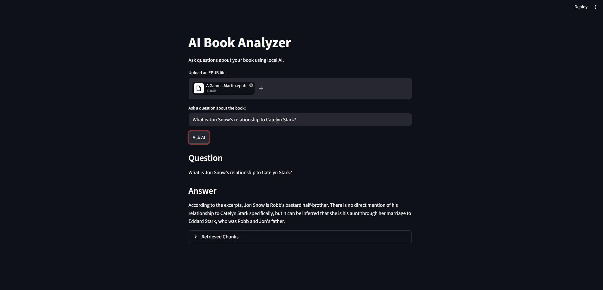

This project can answer questions based on the inputted EPUB file, which is a type of E book file.

It uses Python, Langchain, Streamlit, Ollama, ChromaDB, ebooklib, BeautifulSoup

It takes the EPUB file and splits into smaller chunks.

After the user asks the question, ChromaDB uses semantic retrieval to find the most relevant chunks

The AI uses the top 5 chunks to answer the question not the whole book.

How to run:

Navigate to this folder in command prompt and put 

"pip install -r requirements.txt"

and then

"streamlit run app.py"

### Upload Interface

